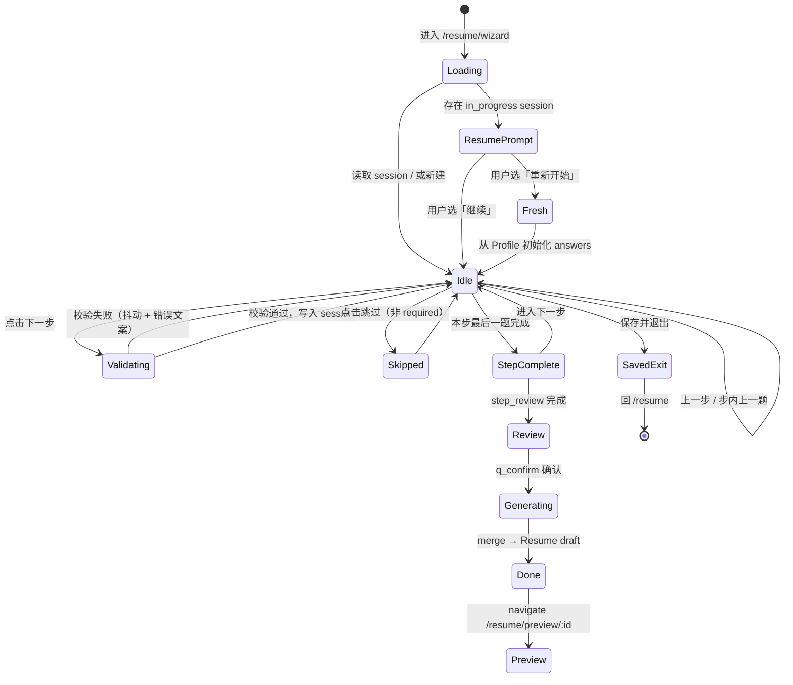
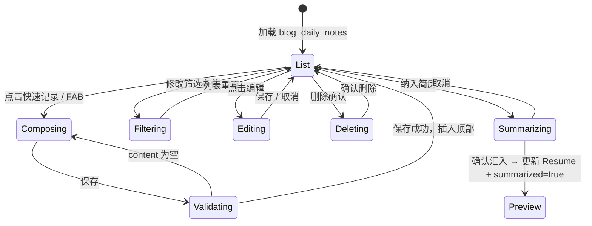
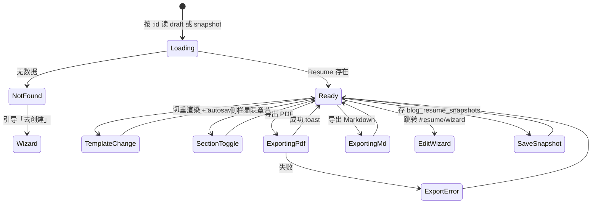

# 简历生成功能 · UX 设计规范

> 版本：v1.0 | 日期：2026-06-02 | 任务：`cf3f7a9d-a5f5-4f46-8b68-1513c427cc2e`  
> 对齐：`Navbar` / `About` / `Layout` 视觉体系，`src/types/resume.ts`、`resumeWizard.ts`

---

## 1. 设计目标与约束

### 1.1 目标

在现有 vibecoding-blog 上新增三条用户路径，风格与全站一致：

| 页面 | 路由（建议） | 核心任务 |
|------|-------------|----------|
| 简历向导 | `/resume/wizard` | 分步问答 → 生成 `Resume` 草稿 |
| 点滴记录 | `/resume/notes` | 快速记录 → 历史列表 → 可选汇入简历 |
| 简历展示 | `/resume/preview` 或 `/resume/preview/:id` | 预览 → 切换模板 → 导出 PDF |

### 1.2 视觉基线（与现有站一致）

从 `Navbar.tsx`、`About.tsx`、`Layout.tsx` 提取的设计 token：

| 元素 | 亮色 | 暗色 |
|------|------|------|
| 页面背景 | `bg-gray-50` | `dark:bg-gray-950` |
| 卡片表面 | `bg-white` + `border-gray-200` | `dark:bg-gray-900` + `dark:border-gray-700` |
| 主标题 | `text-gray-900` | `dark:text-white` |
| 正文/辅助 | `text-gray-600` / `text-gray-400` | `dark:text-gray-300` / `dark:text-gray-400` |
| 品牌强调 | `text-indigo-600` / `bg-indigo-600` | `dark:text-indigo-400` / `dark:bg-indigo-500` |
| 圆角层级 | 输入/按钮 `rounded-lg`～`rounded-2xl`，大区块 `rounded-3xl` | 同左 |
| 容器宽度 | 内容区 `max-w-4xl mx-auto px-4`（向导/点滴）；预览页可用 `max-w-5xl` | 同左 |
| 顶栏 | 沿用 `Layout` + `Navbar`：`sticky`、`backdrop-blur`、`h-14` | 同左 |
| 图标 | `lucide-react`，尺寸 16～24px | 同左 |

**禁止**：引入与全站脱节的新主色（如纯绿主按钮）；PDF 预览区除外可使用「纸张白」模拟打印效果。

### 1.3 Navbar 集成

在 `navLinks` 中新增一项（建议放在「关于」之前）：

```ts
{ to: '/resume', label: '简历' }
```

`/resume` 作为 **Resume Hub**（轻量入口，三卡片跳转），非本任务三页之一，但需在 UX 上串联三条路径。

---

## 2. 全局信息架构与用户流

```mermaid
flowchart LR
  subgraph entry [入口]
    Nav[Navbar 简历]
    AboutCTA[About AI 简历区块]
    HomeCTA[Home PDF 按钮]
  end

  Hub[/resume Hub]

  subgraph core [三核心页]
    W[/resume/wizard]
    N[/resume/notes]
    P[/resume/preview/:id]
  end

  Nav --> Hub
  AboutCTA --> Hub
  HomeCTA --> P
  Hub --> W
  Hub --> N
  Hub --> P
  W -->|完成向导| P
  N -->|汇入简历| P
  N -.->|继续完善| W
```

**跨页数据流**：

1. 向导完成 → `resumeService.saveDraft()` → 跳转预览页 `?from=wizard`
2. 点滴「纳入简历」→ 更新 `Resume.projects[].highlights` 或 `workExperiences[].bullets` → 跳转预览
3. 预览页切换模板 → 仅改 `resume.meta.templateId`，实时重渲染

---

## 3. 页面 A：简历向导页 `/resume/wizard`

### 3.1 页面布局（桌面 ≥ md）

```
┌─────────────────────────────────────────────────────────────┐
│ Navbar (全站)                                                │
├─────────────────────────────────────────────────────────────┤
│ max-w-4xl mx-auto px-4 py-8                                  │
│                                                              │
│  [← 返回简历中心]     简历向导                    [保存并退出] │
│                                                              │
│  ┌─ WizardProgress ─────────────────────────────────────┐  │
│  │  Step 1 ●━━ Step 2 ○━━ ... ━━ Step 7 ○   3/7 基本信息  │  │
│  └──────────────────────────────────────────────────────┘  │
│                                                              │
│  ┌─ StepHeader ─────────────────────────────────────────┐  │
│  │  h1: 基本信息                                          │  │
│  │  p:  让招聘方快速了解你是谁、如何联系你                  │  │
│  └──────────────────────────────────────────────────────┘  │
│                                                              │
│  ┌─ QuestionCard (当前题，单题聚焦) ─────────────────────┐  │
│  │  label + required *                                    │  │
│  │  helpText (text-sm text-gray-500)                      │  │
│  │  ┌─ AnswerInput (按 type 切换) ─────────────────────┐ │  │
│  │  │  text / textarea / month / tags / select ...       │ │  │
│  │  └───────────────────────────────────────────────────┘ │  │
│  │  [从 Profile 预填提示条] (有默认值时显示)               │  │
│  └──────────────────────────────────────────────────────┘  │
│                                                              │
│  ┌─ StepQuestionNav (本步多题时) ────────────────────────┐  │
│  │  ● ○ ○ ○ ○  (题内圆点，5 题/步)                        │  │
│  └──────────────────────────────────────────────────────┘  │
│                                                              │
│  [上一步]                              [跳过此题] [下一步 →]  │
│                                                              │
│  ┌─ WizardSidebarHint (md+ 可选折叠) ────────────────────┐  │
│  │  💡 填写技巧 / 本步预计 2 分钟                         │  │
│  └──────────────────────────────────────────────────────┘  │
└─────────────────────────────────────────────────────────────┘
│ Footer                                                       │
└─────────────────────────────────────────────────────────────┘
```

**移动端**：进度条改为顶部细条 + 当前步标题；侧边提示并入 `QuestionCard` 底部 `helpText`；主操作区 `sticky bottom-0` 双按钮全宽。

### 3.2 组件层级结构

```
pages/ResumeWizard.tsx
├── layout: 标准 max-w-4xl 容器 + 页头
├── components/resume/wizard/
│   ├── WizardPageHeader.tsx          # 返回、标题、保存退出
│   ├── WizardProgress.tsx            # 7 步进度（RESUME_WIZARD_STEPS）
│   ├── WizardStepHeader.tsx          # 当前 step title + description
│   ├── WizardQuestionCard.tsx        # 单题卡片外壳
│   ├── WizardAnswerInput.tsx         # 按 WizardQuestionType 分发
│   │   ├── TextAnswer.tsx
│   │   ├── TextareaAnswer.tsx
│   │   ├── MonthAnswer.tsx
│   │   ├── TagsAnswer.tsx
│   │   ├── SelectAnswer.tsx
│   │   └── MultiSelectAnswer.tsx
│   ├── WizardPrefillBanner.tsx       # 「已从个人资料填入」
│   ├── WizardQuestionDots.tsx        # 步内题序导航
│   └── WizardFooterActions.tsx       # 上一步 / 跳过 / 下一步
└── hooks/useResumeWizard.ts          # 会话读写 blog_resume_wizard
```

### 3.3 向导步骤与 UI 映射

与 `RESUME_WIZARD_STEPS`（7 步）一一对应：

| order | stepId | 标题 | 题数 | UI 要点 |
|-------|--------|------|------|---------|
| 1 | step_basic | 基本信息 | 5 | 进入页时从 Profile 预填 name/bio→headline；邮箱可从 links 推断 |
| 2 | step_target | 求职目标 | 3 | `q_summary` 用 textarea，4 行；keywords 用 TagsAnswer |
| 3 | step_skills | 核心技能 | 3 | 主技能 tags；次要技能 multi_select 或 tags |
| 4 | step_work_latest | 最近一份工作 | 7 | 成果/指标题强调 STAR；`q_work_metric` 占位示例「提升 40%」 |
| 5 | step_project_main | 代表项目 | 7 | 背景/行动/结果分三题，底部显示 STAR 结构提示 |
| 6 | step_education | 教育背景 | 5 | `q_edu_skip` 为 select「跳过/填写」；选跳过时隐藏后续题 |
| 7 | step_review | 确认生成 | 2 | 模板选择卡片组 + 确认勾选 |

### 3.4 交互状态流程



**关键交互细则**：

| 状态 | 行为 |
|------|------|
| 自动保存 | 每次 `下一步` 成功后 debounce 300ms 写入 `blog_resume_wizard` |
| 恢复会话 | 首次进入若 `status=in_progress`，Modal：`继续填写` / `重新开始` |
| 预填 | 字段有 Profile 映射值时，输入框下显示 `WizardPrefillBanner`：「已使用个人资料中的 xxx，可直接修改」 |
| 校验 | `required` + `minLength`；错误：`border-red-500` + `text-red-600 dark:text-red-400` |
| 跳过 | 仅 `required: false` 显示；跳过后 `answers` 存空或 omit |
| 步内导航 | 同一步多题用圆点切换，不破坏步级进度条 |
| 最后一步 | `q_template` 为三列卡片（classic / modern / minimal 缩略图）；`q_confirm` 勾选「我已核对信息」才可点「生成简历」 |
| 完成 | 主按钮：`bg-indigo-600 hover:bg-indigo-700 text-white rounded-2xl` + `Sparkles` 图标 |

### 3.5 空态与异常

- **无 Profile**：首步顶部 `amber` 提示条，链到 `/admin/profile`
- **生成失败**：Toast + 保留 session，可重试
- **网络无关**：纯本地，无需 loading 骨架超过 200ms

---

## 4. 页面 B：点滴记录页 `/resume/notes`

### 4.1 页面布局

```
┌─────────────────────────────────────────────────────────────┐
│ Navbar                                                       │
├─────────────────────────────────────────────────────────────┤
│ max-w-4xl mx-auto px-4 py-8                                  │
│                                                              │
│  [← 返回]   工作点滴                              [+ 快速记录] │
│                                                              │
│  ┌─ QuickNoteComposer (可折叠，默认展开) ────────────────┐  │
│  │  [分类 chips] achievement | tech_growth | ...         │  │
│  │  ┌ textarea 3 行 ─────────────────────────────────┐  │  │
│  │  │ 今天完成了什么？支持 Markdown…                    │  │  │
│  │  └────────────────────────────────────────────────┘  │  │
│  │  [标签输入]  [关联项目 ▼]  [日期 📅 默认今天]         │  │
│  │                        [取消]  [保存记录]            │  │
│  └──────────────────────────────────────────────────────┘  │
│                                                              │
│  ┌─ NoteFilterBar ──────────────────────────────────────┐  │
│  │  🔍 搜索  | 分类 ▼ | 标签 | 项目 ▼ | 日期范围 | 已汇总 □ │  │
│  └──────────────────────────────────────────────────────┘  │
│                                                              │
│  ┌─ NoteTimeline ───────────────────────────────────────┐  │
│  │  ── 2026年6月 ──                                       │  │
│  │  ┌ NoteCard ─────────────────────────────────────┐   │  │
│  │  │ [分类badge] [已纳入简历✓]              06-02    │   │  │
│  │  │ 正文摘要 2 行…                                  │   │  │
│  │  │ #React #性能  · 关联：博客系统                    │   │  │
│  │  │ [编辑] [删除] [纳入简历 ▾]                       │   │  │
│  │  └────────────────────────────────────────────────┘   │  │
│  │  ┌ NoteCard … ────────────────────────────────────┐   │  │
│  └──────────────────────────────────────────────────────┘  │
│                                                              │
│  [空态插画 + 「写下第一条点滴」]                              │
└─────────────────────────────────────────────────────────────┘
```

### 4.2 组件层级结构

```
pages/ResumeNotes.tsx  (或 Notes.tsx)
├── NotePageHeader.tsx
├── QuickNoteComposer.tsx
│   ├── CategoryChips.tsx           # DAILY_NOTE_CATEGORY_LABELS
│   ├── NoteContentTextarea.tsx
│   ├── NoteTagsInput.tsx
│   ├── NoteProjectSelect.tsx       # Profile.projects
│   └── NoteDatePicker.tsx
├── NoteFilterBar.tsx
├── NoteTimeline.tsx
│   └── NoteMonthGroup.tsx
│       └── NoteCard.tsx
├── NoteEditDrawer.tsx              # 移动端全屏 / 桌面侧栏
├── SummarizeToResumeModal.tsx      # 选择汇入位置 + 预览 bullets
└── hooks/useDailyNotes.ts
```

### 4.3 交互状态流程



**关键交互细则**：

| 功能 | UX 行为 |
|------|---------|
| 快速记录 | 顶部 Composer 默认展开；移动端底部 FAB 滚到 Composer |
| 分类 | 横向 scroll chips，选中 `bg-indigo-100 dark:bg-indigo-900 text-indigo-600` |
| 保存 | 成功后 Composer 清空、toast「已记录」；列表顶部插入动画 `fade-in` |
| 时间线 | 按 `noteDate` 降序，月分组标题 `text-sm font-semibold text-gray-500 uppercase` |
| 已汇总 | `summarized` 卡片显示绿色勾 badge，筛选器可「仅看未汇总」 |
| 纳入简历 | Modal：选择目标（某工作经历 / 某项目 / 个人总结）；展示 AI/规则生成的 bullets 预览，可编辑后确认 |
| 删除 | `confirm()` 或小型 Modal，防误触 |
| 空态 | 与 `AI.tsx` 空文章一致：`border-dashed rounded-3xl py-20` + 图标 `PenLine` |

---

## 5. 页面 C：简历展示页 `/resume/preview/:id`

### 5.1 页面布局（桌面）

```
┌─────────────────────────────────────────────────────────────┐
│ Navbar                                                       │
├─────────────────────────────────────────────────────────────┤
│ max-w-5xl mx-auto px-4 py-6                                  │
│                                                              │
│  [← 简历中心]  简历预览          [编辑向导] [保存快照] [导出 ▾] │
│                                                              │
│  ┌─ PreviewToolbar ─────────────────────────────────────┐  │
│  │  模板: [经典中文] [现代紧凑] [极简]   语言: 中文 ▼      │  │
│  │  缩放: [-] 100% [+]   纸张: A4 纵向                    │  │
│  └──────────────────────────────────────────────────────┘  │
│                                                              │
│  ┌─ 主区域 grid lg:grid-cols-[240px_1fr] ────────────────┐  │
│  │ TemplateSidebar      │  ResumePreviewCanvas          │  │
│  │ · 章节显隐 toggles   │  ┌─────────────────────────┐  │  │
│  │ · 模板缩略列表       │  │  A4 比例白纸 shadow-xl   │  │  │
│  │ · 导出 MD            │  │  (打印样式，不受 dark     │  │  │
│  │                      │  │   主题影响内容区背景)     │  │  │
│  │                      │  │  ResumeTemplateClassic   │  │  │
│  │                      │  │  或 Modern / Minimal     │  │  │
│  │                      │  └─────────────────────────┘  │  │
│  └──────────────────────┴───────────────────────────────┘  │
│                                                              │
│  移动端: Toolbar 底部 fixed；Sidebar 改为底部 Sheet          │
└─────────────────────────────────────────────────────────────┘
```

**打印/PDF 区域**：预览画布使用固定「纸张」样式 `bg-white text-gray-900 shadow-xl`，**不**跟随 `dark:` 反转内容，仅外围 chrome 跟随主题。与 `Home.tsx` 现有 PDF 导出逻辑衔接。

### 5.2 组件层级结构

```
pages/ResumePreview.tsx
├── PreviewPageHeader.tsx
├── PreviewToolbar.tsx
│   ├── TemplateSwitcher.tsx        # 3 模板 tab/卡片
│   ├── ZoomControls.tsx
│   └── ExportMenu.tsx              # PDF | Markdown
├── PreviewLayout.tsx               # 响应式 grid / sheet
│   ├── PreviewSidebar.tsx
│   │   ├── SectionVisibilityList.tsx
│   │   └── TemplateThumbList.tsx
│   └── ResumePreviewCanvas.tsx
│       └── templates/
│           ├── ResumeTemplateClassic.tsx
│           ├── ResumeTemplateModern.tsx
│           └── ResumeTemplateMinimal.tsx
├── ExportPdfButton.tsx             # html2canvas + jspdf
└── hooks/useResumePreview.ts
```

### 5.3 模板切换 UX

| 模板 id | 名称 | 切换反馈 |
|---------|------|----------|
| tpl_classic_zh | 经典中文 | 默认；单栏分段标题左侧色条 `indigo-600` |
| tpl_modern_zh | 现代紧凑 | 技能+项目前置；左栏窄信息区 `bg-gray-50` |
| minimal（待增） | 极简 | 大字号姓名、减少边框 |

切换时：

1. 更新 `resume.meta.templateId`
2. Canvas 内 `cross-fade` 200ms
3. Toolbar 高亮当前模板 `ring-2 ring-indigo-500`

### 5.4 交互状态流程



**导出 PDF 流程**：

1. 按钮进入 `loading`（`Loader2` 旋转 + 禁用）
2. 对 `ResumePreviewCanvas` 内纸张节点 `html2canvas`（`scale: 2`, `useCORS: true`）
3. `jspdf` A4 分页
4. 文件名：`{name}-简历-{templateId}-{date}.pdf`
5. 成功 toast；失败显示「请缩小内容或关闭图片跨域」

### 5.5 与 About / Home 的衔接

| 来源 | 落地行为 |
|------|----------|
| About「进入 AI 工作台」 | 建议改为「开始简历向导」→ `/resume/wizard` |
| About「一键下载 MD」 | 保留，或统一到预览页 Export MD |
| Home PDF 按钮 | 可跳转 `/resume/preview/latest` 并自动触发导出 |

---

## 6. 共享组件与可复用模式

### 6.1 建议新增的 `components/resume/ui/`

| 组件 | 用途 | 样式参考 |
|------|------|----------|
| `ResumeCard` | Hub / 模板选择卡片 | `About` AI 区块 `rounded-3xl border indigo gradient` |
| `ResumePrimaryButton` | 主 CTA | `About` 248-258 行 indigo 按钮 |
| `ResumeSecondaryButton` | 次 CTA | `border-gray-300 dark:border-gray-600 rounded-2xl` |
| `ResumeBadge` | 分类/状态 | `About` 精选 `amber` / `indigo` pill |
| `ResumeEmptyState` | 空列表 | `AI.tsx` 74-78 虚线框 |
| `ResumeConfirmModal` | 删除/重置确认 | 白/灰-900 卡片 + `backdrop-blur` |

### 6.2 无障碍

- 进度条：`aria-valuenow` / `aria-valuemax`
- 向导题：`label` + `htmlFor` 关联
- 主题切换：不改变预览纸张对比度
- 焦点环：`focus-visible:ring-2 focus-visible:ring-indigo-500`

### 6.3 响应式断点

| 断点 | 向导 | 点滴 | 预览 |
|------|------|------|------|
| `< md` | 步进条简化为 `3/7` 文字 | FAB + 全宽 Composer | 侧栏 → Bottom Sheet |
| `md+` | 完整步进圆点 | 双列筛选可选 | 左栏 240px 固定 |

---

## 7. 动效与微交互（克制）

- 页面切换：无全页动画，依赖 React Router 默认
- 步进：`QuestionCard` 左右 slide 150ms（`prefers-reduced-motion` 时禁用）
- 保存成功：toast 2s，不阻断
- 卡片 hover：`hover:shadow-xl` + `hover:border-indigo-200`（与 `Projects` 一致）
- 按钮 active：`active:scale-[0.985]`（与 `About` 一致）

---

## 8. 实现检查清单（供开发对照）

- [ ] 三页均使用 `Layout`，不单独造顶栏
- [ ] 所有表单/列表容器使用 `dark:` 双色
- [ ] 向导 7 步与 `RESUME_WIZARD_STEPS` 同步
- [ ] 点滴分类使用 `DAILY_NOTE_CATEGORY_LABELS`
- [ ] 预览模板使用 `DEFAULT_RESUME_TEMPLATES`
- [ ] localStorage keys 使用 `RESUME_STORAGE_KEYS`
- [ ] Navbar 增加「简历」入口
- [ ] PDF 画布打印色独立于 dark mode

---

## 9. 附录：路由与文件对照

| 路由 | 页面文件 | 优先级 |
|------|----------|--------|
| `/resume` | `ResumeHub.tsx` | P0 入口 |
| `/resume/wizard` | `ResumeWizard.tsx` | P0 |
| `/resume/notes` | `ResumeNotes.tsx` | P1 |
| `/resume/preview/:id` | `ResumePreview.tsx` | P0 |

本 UX 文档覆盖任务要求的三页核心流程；Hub 与路由命名与 `docs/PRD-resume-system.md`、`docs/resume-architecture.md` 保持一致，便于下游开发直接拆分任务。
